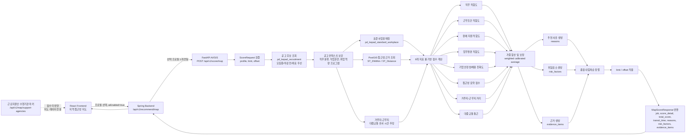

# BridgeWork AI/GIS Server

장애인 구직자의 프로필과 공공데이터를 결합해 **일자리 적합도**, **근무지 접근성**, **장애 지원 가능성**, **추천 사유**를 계산하는 FastAPI 기반 AI/GIS 분석 서버입니다.

BridgeWork 전체 서비스에서 이 레포는 Spring Backend가 내부 API로 호출하는 AI 분석 서버 역할을 담당합니다. 프론트엔드는 FastAPI를 직접 호출하지 않고, Spring Backend가 인증/프로필/공공데이터 동기화/API 게이트웨이를 처리한 뒤 필요한 분석 요청만 FastAPI로 전달합니다.

## 전체 구조

```text
React Frontend (Vercel)
  -> HTTPS API / Nginx
  -> Spring Backend
  -> FastAPI AI/GIS Server
  -> PostgreSQL/PostGIS + OpenAI API
```

<p align="center">
  
</p>

아래 표의 레포명을 클릭하면 각 GitHub 레포지토리로 이동합니다.

| 레포 | 역할 |
| --- | --- |
| [frontend](https://github.com/nodongservice/frontend) | React 웹 클라이언트, 소셜 로그인, 온보딩, 프로필, 추천/지도 화면 |
| [backend](https://github.com/nodongservice/backend) | Spring Boot API 서버, 인증/프로필/공공데이터 동기화, FastAPI 게이트웨이 |
| [aiserver](https://github.com/nodongservice/aiserver) | FastAPI AI/GIS 분석 서버, 스코어링, OCR/LLM 프로필 초안, 추천 설명 생성 |
| [backend-infra](https://github.com/nodongservice/backend-infra) | Nginx, Blue/Green 전환 스크립트, Prometheus/Grafana/Loki/Alloy 모니터링 |

## 핵심 기능

### 1. 포트폴리오 PDF 기반 프로필 초안 생성

<p align="center">
  
</p>

사용자가 PDF 이력서/포트폴리오를 업로드하면 Spring Backend가 파일을 검증하고 FastAPI로 전달합니다. FastAPI는 PDF 텍스트를 추출한 뒤, 품질이 낮은 페이지만 OCR로 보강하고, OpenAI Responses API와 JSON Schema를 이용해 BridgeWork 프로필 스키마에 맞는 초안을 생성합니다.

- `pypdf`로 페이지별 임베디드 텍스트 추출
- 한글 비율, 깨짐 문자, 제어문자, 긴 토큰, 이력서 키워드 기반 텍스트 품질 평가
- 저품질 페이지에 한해 `PaddleOCR` 수행
- 임베디드 텍스트와 OCR 결과 중 신뢰도 높은 텍스트 선택
- OpenAI Responses API + strict JSON Schema로 프로필 필드 구조화
- 근거가 부족한 필드는 추측하지 않고 `null`로 반환
- `missingFields`, `confidence`, `warnings`를 함께 제공해 사용자 확인/수정 흐름 지원

### 2. 퀵 맞춤 일자리 추천

<p align="center">
  
</p>

퀵 추천은 별도 퀵공고 화면에서 현재 유효한 공고를 빠르게 확인하는 흐름입니다. AI 직무 적합도 토글이 켜져 있으면 Spring Backend가 선택된 프로필 1개를 FastAPI로 전달하고, FastAPI가 직무 적합도·근무조건·거리를 반영한 추천 점수와 근거를 계산합니다.

- 모집 중이고 마감일이 지나지 않은 장애인 구인 공고 조회
- 프로필 선호도, 좌표 유무, 최신 등록일을 반영한 후보 선순위 계산
- `limit`/`offset` 기반 페이지네이션
- 지원 직무·기술·학력·경력, 근무조건, 거주지-근무지 거리 비교
- `job_fit_score` 필드에 보정된 퀵 추천 점수와 추천 근거·위험요소·통근 추정 근거 반환
- AI 토글 OFF 시 Spring Backend가 최신 공고만 조회

### 3. 지역 접근성 지도 추천



지도 추천은 공고의 근무지 주변 접근성 공공데이터와 사용자 프로필을 함께 분석해 종합 점수를 계산합니다. 점수는 LLM이 직접 결정하지 않고, FastAPI의 룰 기반 스코어링 모듈이 계산합니다.

현재 구현은 8개 지표를 가중 합산한 뒤 점수 분포를 보정합니다.

| 지표 | 가중치 | 설명 |
| --- | ---: | --- |
| 직무 적합도 | 24% | 직무명, 요구 경력, 학력, 자격, 기술 키워드 기반 적합도 |
| 근무지 접근성 | 20% | 이동지원센터, 버스정류장, 횡단보도, 신호등, 철도·지하철 편의시설 근거 |
| 근무조건 적합도 | 12% | 고용형태, 임금형태, 모집기간, 근무 가능 조건 |
| 업무환경 적합도 | 12% | 양손사용, 시력, 듣고 말하기, 서거나 걷기, 드는힘 등 작업환경 |
| 장애 지원 적합도 | 10% | 장애 유형·정도, 표준사업장 매칭, 지원 필요사항 |
| 기업 안정성·채용 친화도 | 8% | 표준사업장 인증, 담당기관, 공고 등록 정보 |
| 거주지-근무지 거리 | 7% | 좌표 기반 직선거리와 이동 가능 범위 |
| 대중교통 통근 | 7% | 좌표 거리와 지역 보정 계수를 이용한 통근시간 추정 |

<p align="center">
  
</p>

### 4. 추천 설명 생성

스코어링 결과는 바로 사용자 문장으로 노출하지 않고, 별도 설명 생성 API를 통해 추천 사유, 주의사항, 체크리스트로 변환합니다.

- LLM은 점수를 결정하지 않음
- 이미 계산된 점수, 근거, 위험요소만 설명 재료로 사용
- 제공자 설정에 따라 OpenAI 기반 설명 또는 룰 기반 fallback 설명 사용
- 상담기관 또는 사용자 화면에서 바로 읽을 수 있는 문장 형태로 반환

## AI/GIS 처리 원칙

- **근거 기반 계산**: 공공데이터와 프로필 입력값을 기준으로 점수를 계산합니다.
- **LLM 역할 제한**: LLM은 구조화와 설명 생성에 사용하며, 핵심 점수는 룰 기반으로 산정합니다.
- **불확실성 보존**: 정보가 부족한 필드는 추측하지 않고 `null`, `추가 확인 필요`, `warnings`로 전달합니다.
- **PostGIS 활용**: 근무지 좌표 주변의 접근성 데이터를 반경 기반으로 조회합니다.
- **운영 안정성**: OCR 프로세스 격리, OCR 대상 페이지 최소화, 접근성 조회 캐시, 헬스체크/메트릭을 제공합니다.

## 기술 스택

| 영역 | 사용 기술 |
| --- | --- |
| API | FastAPI, Uvicorn, Pydantic |
| DB/GIS | PostgreSQL, PostGIS, SQLAlchemy, GeoAlchemy2 |
| OCR | pypdf, pypdfium2, PaddleOCR, PaddlePaddle |
| AI | OpenAI Responses API, JSON Schema Structured Outputs |
| 운영 | Docker, GHCR, GitHub Actions, Blue/Green deployment |
| 관측 | Prometheus metrics, Grafana, Loki, Alloy |
| 품질 | pytest, ruff, pre-commit, uv |

## 데이터 사용

공공데이터 수집과 정규화는 `backend`가 담당하며, FastAPI는 Spring DB의 정규화 테이블을 직접 조회해 스코어링에 사용합니다.

대표 데이터:

- 한국장애인고용공단 장애인 구인 실시간 현황
- 한국장애인고용공단 장애인 표준사업장 실시간 조회
- 한국장애인고용공단 근로지원인 수행기관 정보
- 전국교통약자이동지원센터 표준데이터
- 전국 버스정류장, 횡단보도, 신호등 데이터
- 서울 지하철 출입구 리프트, 도보 네트워크, 휠체어 경사로 데이터
- 한국철도공사/KRIC 교통약자 편의시설 데이터

상세 데이터 출처와 동기화 방식은 `backend/README.md`를 기준으로 합니다.

## 팀

| 이름 | 담당 |
| --- | --- |
| 장혜진 | 기획 |
| 김수인 | 디자인 |
| 최성현 | 백엔드 및 인프라 |
| 박민정 | 프론트 및 AI 개발 |
